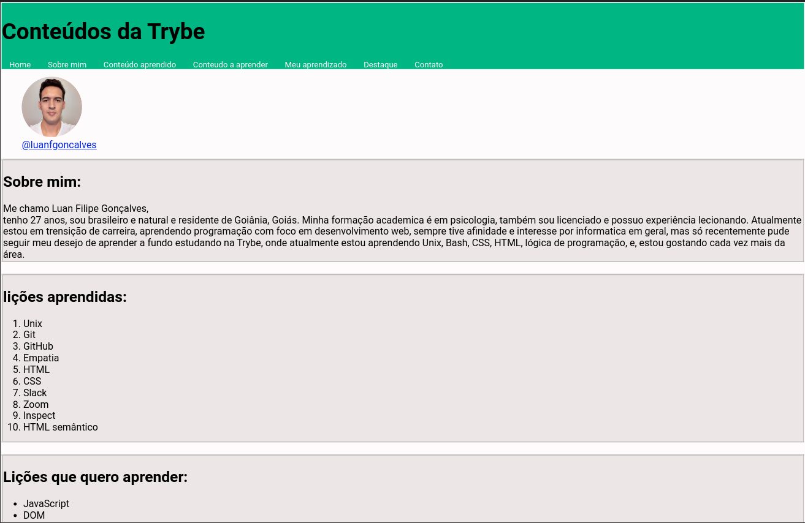

<!-- Introdução -->
## <h1 align="center"> Projeto Lessons Learned  - :one: </h1>

Este é meu primeiro projeto desenvolvido em minha jornada de aprendizado como desenvolvedor na Trybe,
nele desenvolvi uma página simples para demonstar conhecimentos básicos.

#

<h2 align="center"> Habilidades Desenvolvidas: </h2>

* Utilizei _HTML_ para construir páginas WEB. :heavy_check_mark:
* Utilizei _HTML_ semântico para tornar minha página mais acessível e melhor ranqueada. :heavy_check_mark:
* Utilizei _CSS_ para adicionar estilo e posicionar elementos. :heavy_check_mark:

#

<h2 align="center"> Preview </h2>

  

#

<!-- Ferramentas utilizadas -->

  

	  <h2>Ferramentas e Tecnologias utilizadas:</h2>
	

  

  | Linguagens              | Tecnologias             |
  | :---------------------- | :---------------------- |
  | JavaScript              | HTML                    |
  | .                       | CSS                     |
  | .                       | Git                     |

  

#

<!-- Instalação e utilização -->

  

    <h2>Como instalar e utilizar o projeto:</h2>
  

  

    <h3>Especificações Tecnicas:</h3>
  

  * Git - <i> `git -v` informará a versão em uso.</i>

  #

  

  1. Faça a clonagem do projeto - <i>O projeto não utiliza nenhuma dependência externa.</i>
  >`git clone git@github.com:luanfgoncalves/project-lessons-learned.git`
  1. Abra o arquivo Index.html - <i>Localizado na raíz do projeto.</i>

#

<!-- Instalação e utilização -->
<h2 align="center"> Connect with me: </h2>

  
  
   

